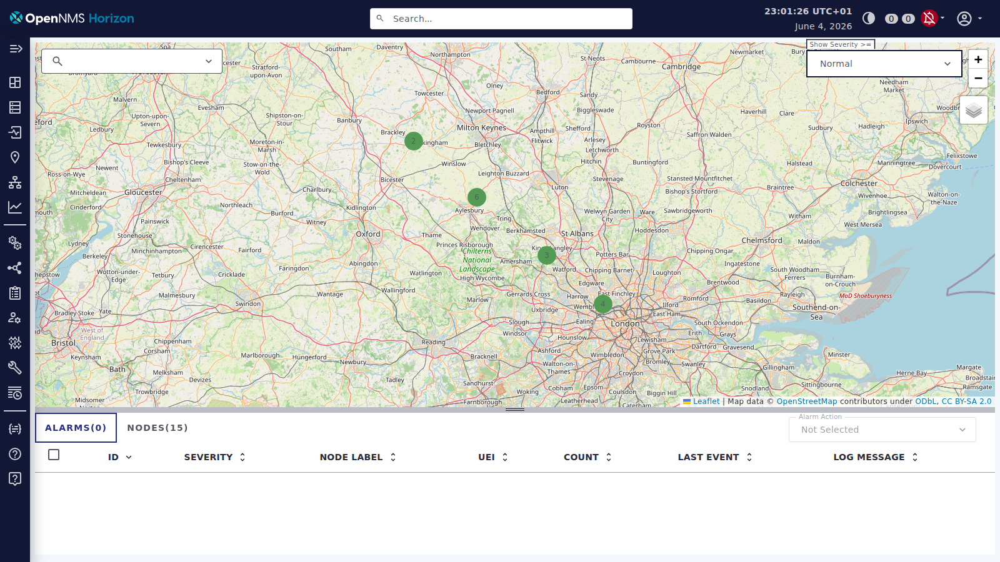
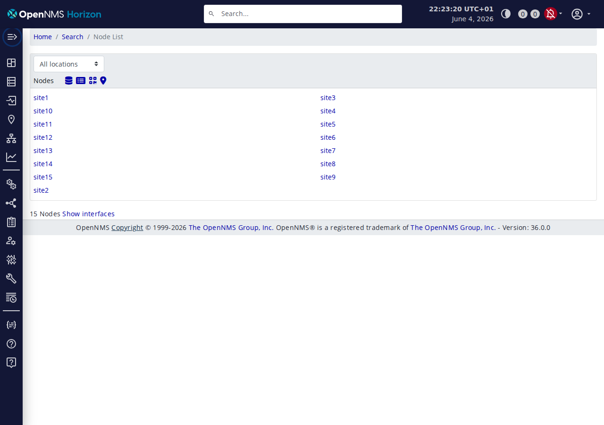
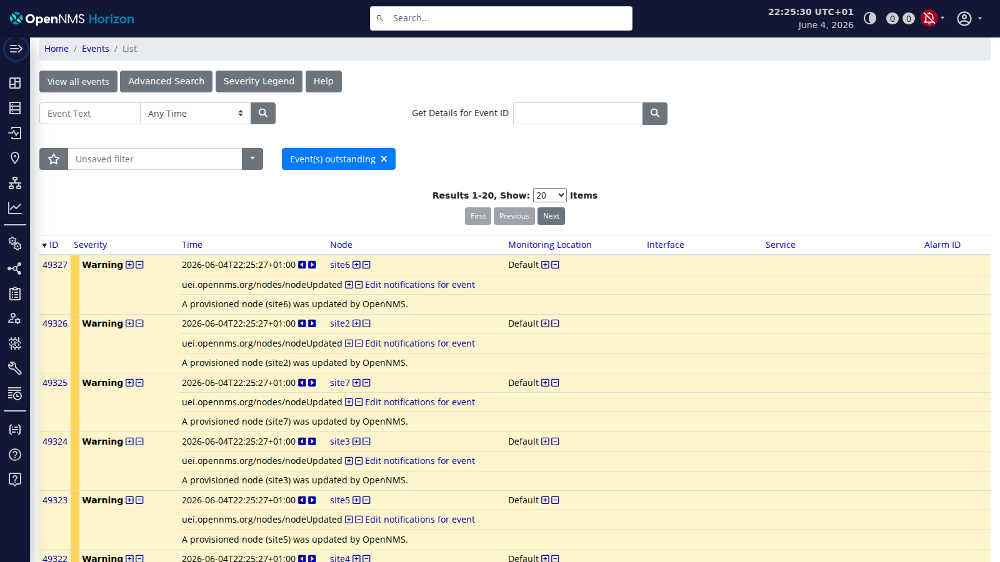

# MQTT IoT Monitoring Lab — OpenNMS Edition

A fully containerised MQTT IoT monitoring lab combining **Eclipse Mosquitto**, **OpenNMS Horizon**, and a Python **sidecar** to simulate 30 IoT sites along the M6 corridor, auto-provision OpenNMS nodes with GPS inventory, and visualise telemetry via the Geo Map and Events views.

---

## Architecture

```
┌─────────────────────────────────────────────────────────────────┐
│                        Docker Compose Stack                     │
│                                                                 │
│  iot-publisher-multi  (Alpine — publisher.sh)                   │
│  Publishes every 10s:                                           │
│    lab/temp/site{1-30}       lab/humidity/site{1-30}            │
│    lab/power/site{1-30}      lab/location/site{1-30}            │
│    lab/discovery  (retained JSON — site list)                   │
│                      │                                          │
│              ┌───────▼────────────┐                             │
│              │    mosquitto       │  Eclipse Mosquitto :1883    │
│              └───┬───────────────-┘                             │
│                  │                                              │
│      ┌───────────▼──────────────────────────────┐              │
│      │  opennms-mqtt-sidecar (Python)            │              │
│      │  • Creates nodes in MQTT-Sites requisition│              │
│      │  • Sets lat/lon asset fields (Geo Map)    │              │
│      │  • Forwards metrics as OpenNMS events     │              │
│      └───────────────────────────┬───────────────┘              │
│                                  │ REST API                     │
│   ┌──────────────────────────────▼────────────────────┐         │
│   │  opennms (Horizon)  :8980   │  db (PostgreSQL 15)  │         │
│   └─────────────────────────────────────────────────-─┘         │
└─────────────────────────────────────────────────────────────────┘
```

**Division of responsibility:**

| Component | Responsibility |
|---|---|
| **Publisher** | Simulates IoT sites — publishes temp, humidity, power, location & discovery JSON |
| **Sidecar** | Creates OpenNMS nodes with lat/lon inventory; forwards sensor metrics as events |
| **OpenNMS** | Stores nodes, events, alarms; renders Geo Map with site pins |

---

## Screenshots

### Geo Map — M6 Corridor

Sites provisioned by the sidecar appear as node pins along the M6 corridor from London to Newcastle. Clicking a pin opens the node detail page.


*15 IoT sites pinned along the southern M6 corridor (one publisher). Scale with `--scale iot-publisher-multi=N` to populate more of the route.*

### Node List

All provisioned IoT sites appear in the `MQTT-Sites` requisition with latitude/longitude asset fields set by the sidecar.



### Events

Provisioning and metric events arrive in OpenNMS for each site. The Events view is the primary observability surface — OpenNMS has no native MQTT collection agent, so sensor readings come in as events rather than RRD time-series.



> **Generate screenshots:** See `scripts/screenshot.py` — requires Playwright (`pip install playwright && playwright install chromium`).
> Geo Map URL (OpenNMS 36): `http://localhost:8980/opennms/ui/index.html#/map`

---

## Known Issues / Outstanding Work

### Sidecar startup sync does not restore provisioned state across restarts

On restart the sidecar should query OpenNMS to learn which sites are already provisioned (so it doesn't re-provision them). The current startup sync uses `GET /opennms/rest/requisitions/MQTT-Sites` but this endpoint returns XML and can throw exceptions under load. As a result, `provisioned` starts empty and the sidecar re-provisions all 15 sites on every restart — which is harmless (it's idempotent) but creates extra events and API load. **Fix needed:** switch startup sync to `GET /opennms/rest/nodes?foreignSource=MQTT-Sites` (which has reliable JSON support) and parse `foreignId` fields.

### Event flood from location updates under load

Before the location-first provisioning fix, the sidecar was triggering a `rescanExisting=true` import every 10 seconds per site (once per MQTT location message). This floods OpenNMS with `nodeUpdated` events and can make the REST API unresponsive. The current code uses `location_confirmed` to prevent repeated updates — each site's location is corrected at most once per sidecar restart. If the sidecar is restarted frequently (e.g. during development), this still multiplies. **Workaround:** `docker compose down -v` and let the sidecar provision fresh.

### OpenNMS collection charts require a Minion or custom collector

OpenNMS has no native MQTT collection agent. The sidecar bridges MQTT → OpenNMS events, so sensor readings appear in the Events view but **not** in RRD time-series graphs. For historical graphing, add a Grafana + InfluxDB sidecar that also subscribes to `lab/#`.

### Geo Map URL changed in OpenNMS 36

The legacy `/opennms/map/index.jsp` path returns 404 in OpenNMS 36. The Geo Map is now at:
```
http://localhost:8980/opennms/ui/index.html#/map
```
The `screenshot.py` and quickstart docs have been updated to use the correct URL.

---

## Components

| Container | Image | Role |
|---|---|---|
| `mosquitto` | `eclipse-mosquitto:2` | MQTT broker on port 1883 |
| `iot-publisher-multi` | `alpine:3.20` | Simulates IoT sites — publishes temp, humidity, power, location & discovery |
| `opennms-mqtt-sidecar` | *(built from `./sidecar`)* | Watches MQTT, auto-creates OpenNMS nodes with lat/lon; forwards metrics as events |
| `opennms` | `opennms/horizon:latest` | OpenNMS Horizon monitoring server (port 8980) |
| `db` | `postgres:15` | OpenNMS backend database |

---

## MQTT Topic Structure

| Topic | Payload | Description |
|---|---|---|
| `lab/temp/site{N}` | `float` | Temperature °C — sinusoidal diurnal cycle |
| `lab/humidity/site{N}` | `float` | Humidity % — constant 65% |
| `lab/power/site{N}` | `float` | Power W — sinusoidal with 1hr lag behind temp |
| `lab/location/site{N}` | `lat,lon` | GPS coordinates interpolated along M6 corridor |
| `lab/discovery` | JSON (retained) | Site list — `[{"{#SITE}":"site1"},...]` |

Site positions are interpolated along the M6 route (London → Coventry → Birmingham → Manchester → Preston → Newcastle) so the Geo Map renders a realistic corridor.

---

## OpenNMS Provisioning

The sidecar uses the OpenNMS REST provisioning API to create nodes automatically:

| Object | Detail |
|---|---|
| **Requisition** | `MQTT-Sites` — created on sidecar startup if absent |
| **Nodes** | One per discovered site (`site1`–`site30`) with label matching site ID |
| **Interface** | `127.0.0.1` with ICMP monitored service |
| **Asset fields** | `latitude`, `longitude` (set from `lab/location/<site>` payload), `description`, `building` |
| **Events** | `uei.opennms.org/generic/traps/SNMP_Trap_Fallback` — one per metric reading |

Nodes appear in the Geo Map once the requisition sync completes (~5–10 seconds after creation).

---

## Lessons Learned

### OpenNMS requisitions require an explicit sync step

Adding a node to a requisition via `POST /opennms/rest/requisitions/{source}/nodes` does **not** immediately make it visible. You must trigger `PUT /opennms/rest/requisitions/{source}/import?rescanExisting=false` to actually import the node. Without this step, the Geo Map shows nothing.

### Asset latitude/longitude control Geo Map pin placement

OpenNMS Geo Map uses the `latitude` and `longitude` asset fields — set via `<asset name="latitude" value="..."/>` in the requisition XML. The values must be decimal degrees (e.g. `53.4808`) not DMS format.

### OpenNMS startup takes 2–3 minutes

Horizon is a heavy JVM application. The sidecar retries the `/opennms/rest/info` endpoint with 30 × 10s attempts. Do not reduce this — premature API calls return 503 and confuse the startup logic.

### Events have no built-in retention limit

Every MQTT reading generates an event. At 30 sites × 3 metrics × every 10s, OpenNMS accumulates ~15,000 events/hour. This is fine for a lab but configure `vacuumd` and event archiving for longer runs.

### MQTT collection is sidecar-only (no native OpenNMS MQTT)

OpenNMS Horizon has no built-in MQTT collector. All MQTT → OpenNMS bridging is handled by `sidecar.py`. If you need time-series graphs (not just events), consider adding a Grafana + InfluxDB sidecar that also subscribes to `lab/#`, or extend the sidecar to write to an external time-series store.

### Node IDs are assigned post-import

After `PUT .../import`, the node ID assigned by OpenNMS cannot be predicted. The sidecar uses `GET /opennms/rest/nodes?foreignSource=MQTT-Sites&foreignId={site}` to look up the ID lazily (with a local cache) before attaching node IDs to events.

---

## Repository Structure

```
open-nms-mqtt/
├── docker-compose.yml           # Full stack: OpenNMS, PostgreSQL, Mosquitto, publisher, sidecar
├── mosquitto/
│   └── config/mosquitto.conf    # Allow anonymous, persistence on
├── opennms/
│   └── etc/                     # OpenNMS config overlay (mounted into container)
├── sidecar/
│   ├── sidecar.py               # Node provisioner + event forwarder
│   └── Dockerfile
├── scripts/
│   ├── publisher.sh             # IoT telemetry publisher (Alpine + mosquitto-clients)
│   └── screenshot.py            # Playwright screenshot utility (headless Chromium)
└── docs/screenshots/            # UI screenshots
```

---

## Quick Start

See [QUICKSTART-mick.md](QUICKSTART-mick.md) for step-by-step setup.

```bash
gh repo clone mmorrow24work/open-nms-mqtt ~/git/open-nms-mqtt
cd ~/git/open-nms-mqtt
docker compose up -d
```

OpenNMS UI → **http://localhost:8980** — `admin` / `admin`

---

## References

- [OpenNMS Horizon Documentation](https://docs.opennms.com/horizon/latest/)
- [OpenNMS REST API — Provisioning](https://docs.opennms.com/horizon/latest/development/rest/requisitions.html)
- [OpenNMS Geo Map](https://docs.opennms.com/horizon/latest/operation/deep-dive/maps/geographical-map.html)
- [Eclipse Mosquitto](https://mosquitto.org/)

## Related

- [zabbix-mqtt](https://github.com/mmorrow24work/zabbix-mqtt) — same sensor lab wired to Zabbix instead of OpenNMS
